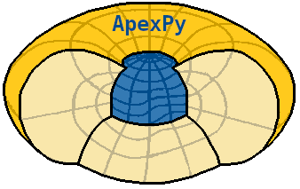

|logo|

========
Overview
========

|docs| |version| |doi|

This is a Python wrapper for the Apex fortran library by
Emmert et al. [2010] [1]_, which allows converting between geodetic, modified
apex, and quasi-dipole coordinates as well as getting modified apex and
quasi-dipole base vectors (Richmond [1995] [2]_). The geodetic system used here
is WGS84. MLT calculations are also included. The package is free software
(MIT license).

Quick start
===========

Install from PyPI using ``pip``::

    pip install apexpy

This assumes that the same version of libgfortran is installed in the same
location as when the pip wheel was built (if a wheel was used). If not, you may
have trouble importing apexpy.  If you run into trouble, try the command::

    pip install --no-binary :apexpy: apexpy

which requires both libgfortran and gfortran to be installed on your system.
More detailed installation instructions (and troubleshooting) is available
in the
`documentation <https://apexpy.readthedocs.io/en/latest/installation.html>`_.

Conversion is done by creating an ``Apex`` object and using its methods to
perform the desired calculations. Some simple examples::

    from apexpy import Apex
    import datetime as dt
    atime = dt.datetime(2015, 2, 10, 18, 0, 0)
    apex15 = Apex(date=2015.3)  # dt.date and dt.datetime objects also work

    # Geodetic to apex, scalar input
    mlat, mlon = apex15.convert(60, 15, 'geo', 'apex', height=300)
    print("{:.12f}, {:.12f}".format(mlat, mlon))
    57.477310180664, 93.590156555176

    # Apex to geodetic, array input
    glat, glon = apex15.convert([90, -90], 0, 'apex', 'geo', height=0)
    print(["{:.12f}, {:.12f}".format(ll, glon[i]) for i,ll in enumerate(glat)])
    ['83.103820800781, -84.526657104492', '-74.388252258301, 125.736274719238']

    # Geodetic to magnetic local time
    mlat, mlt = apex15.convert(60, 15, 'geo', 'mlt', datetime=atime)
    print("{:.12f}, {:.12f}".format(mlat, mlt))
    56.598316192627, 19.107861709595

    # can also convert magnetic longitude to mlt
    mlt = apex15.mlon2mlt(120, atime)
    print("{:.2f}".format(mlt))
    20.90

If you don't know or use Python, you can also use the command line. See details
in the full documentation (link in the section below).

Documentation
=============

https://apexpy.readthedocs.io/en/latest

References
==========

.. [1] Emmert, J. T., A. D. Richmond, and D. P. Drob (2010),
       A computationally compact representation of Magnetic-Apex
       and Quasi-Dipole coordinates with smooth base vectors,
       J. Geophys. Res., 115(A8), A08322, doi:10.1029/2010JA015326.

.. [2] Richmond, A. D. (1995), Ionospheric Electrodynamics Using
       Magnetic Apex Coordinates, Journal of geomagnetism and
       geoelectricity, 47(2), 191–212,
       `doi:10.5636/jgg.47.191 <http://dx.doi.org/10.5636/jgg.47.191>`_.

Badges
======

.. list-table::
    :stub-columns: 1

    * - docs
      - |docs|
    * - tests
      - | |ghactions|
        | |coveralls| |codeclimate|
        | |scrutinizer| |codacy|
    * - package
      - | |version| |supported-versions|
        | |wheel| |supported-implementations|

.. |docs| image:: https://readthedocs.org/projects/apexpy/badge/?style=flat
    :target: https://apexpy.readthedocs.io/en/latest/
    :alt: Documentation Status

.. |ghactions| image:: https://github.com/aburrell/apexpy/actions/workflows/main.yml/badge.svg
    :alt: GitHub Actions Build Status
    :target: https://github.com/aburrell/apexpy/actions/workflows/main.yml

.. |coveralls| image:: https://s3.amazonaws.com/assets.coveralls.io/badges/coveralls_98.svg
    :alt: Coverage Status
    :target: https://coveralls.io/github/aburrell/apexpy?branch=main

.. |codacy| image:: https://api.codacy.com/project/badge/Grade/7d4c1a6c60e747ca95cdf97746c39cda
   :alt: Codacy Badge
   :target: https://app.codacy.com/gh/aburrell/apexpy?utm_source=github.com&utm_medium=referral&utm_content=aburrell/apexpy&utm_campaign=Badge_Grade

.. |codeclimate| image:: https://api.codeclimate.com/v1/badges/da1d972dee790da595f8/maintainability.svg
   :target: https://codeclimate.com/github/aburrell/apexpy
   :alt: CodeClimate Quality Status

.. |version| image:: https://img.shields.io/pypi/v/apexpy.svg?style=flat
    :alt: PyPI Package latest release
    :target: https://pypi.org/project/apexpy/

.. |downloads| image:: https://img.shields.io/pypi/dm/apexpy.svg?style=flat
    :alt: PyPI Package monthly downloads
    :target: https://pypi.org/project/apexpy

.. |wheel| image:: https://img.shields.io/pypi/wheel/apexpy.svg?style=flat
    :alt: PyPI Wheel
    :target: https://pypi.org/project/apexpy

.. |supported-versions| image:: https://img.shields.io/pypi/pyversions/apexpy.svg?style=flat
    :alt: Supported versions
    :target: https://pypi.org/project/apexpy

.. |supported-implementations| image:: https://img.shields.io/pypi/implementation/apexpy.svg?style=flat
    :alt: Supported implementations
    :target: https://pypi.org/project/apexpy

.. |scrutinizer| image:: https://img.shields.io/scrutinizer/quality/g/aburrell/apexpy/main.svg?style=flat
    :alt: Scrutinizer Status
    :target: https://scrutinizer-ci.com/g/aburrell/apexpy/

.. |doi| image:: https://www.zenodo.org/badge/doi/10.5281/zenodo.4585641.svg
   :target: https://doi.org/10.5281/zenodo.1214206

